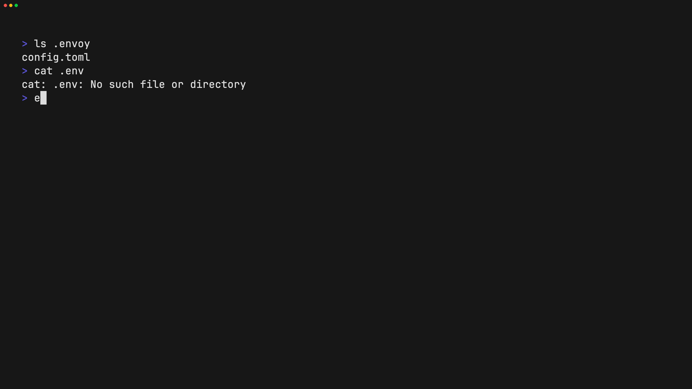

# Envoy

**Envoy** is a secure, Git-like CLI for managing encrypted environment files across machines and teams.

It lets you **encrypt once**, **sync safely**, and **restore automatically** — without ever committing secrets to Git.

---

## Why Envoy?

Managing `.env` files across devices is painful:

- You can’t commit them
- Copying them manually is error-prone
- Sharing them securely is hard
- CI environments need controlled access

Envoy solves this by treating secrets like **versioned artifacts**, not source code.

---

## Core Concepts

Envoy is built around a few simple ideas:

- **Secrets are encrypted locally** (never plaintext on the server)
- **Encrypted blobs are content-addressed** (SHA-256)
- **Commits track manifest history** (like Git)
- **Git tracks intent, not data**
- **Cache is disposable**
- **Remotes behave like Git remotes**

If you understand Git, Envoy will feel familiar.

---

## Installation

### Quick Install

**macOS/Linux:**

```bash
curl -fsSL https://raw.githubusercontent.com/denizlg24/envoy/master/install.sh | bash
```

**Windows (PowerShell):**

```powershell
iwr -useb https://raw.githubusercontent.com/denizlg24/envoy/master/install.ps1 | iex
```

### From Source

#### Requirements

- Rust (stable)
- Cargo

```bash
cargo install envoy-cli
```

Or build locally:

```bash
cargo build --release
```

---

## Authentication

Envoy uses GitHub OAuth (device flow).

```bash
envy login
```

This stores an API token in:

```bash
$HOME/.envoy/config.toml
```

Logout at any time:

```bash
envy logout
```

---

## Getting Started

### 1. Initialize a project

```bash
envy init
```

This creates the `.envoy/` directory and sets up the default remote (`origin`).

### 2. Choose files to encrypt

Add files (default `.env`) using your workflow.  
Secrets are tracked internally and never committed to Git.

```bash
envy encrypt
envy encrypt --input .env.testing
```

### 3. Commit changes

```bash
envy commit -m "Add production secrets"
```

- Creates an encrypted commit object
- Links to the current manifest state
- Updates local HEAD

### 4. Push to remote

```bash
envy push
```

- Uploads encrypted blobs and commits
- Updates remote HEAD

### 5. Pull and restore secrets

```bash
envy pull
```

- Downloads encrypted blobs and commits
- Decrypts them locally
- Restores files to their original paths

### 6. Check status

```bash
envy status
```

- Shows current manifest state
- Displays uncommitted changes
- Fetches remote to show sync status

---

## Quick demos

The following animated demos show common Envoy workflows.

### Initialize a project


### Encrypt a file


### Pull and restore secrets



---

## Configuration

### Project config (tracked)

`.envoy/config.toml`

```toml

version = 1
project_id = "..."
name = "..."

default_remote = "origin"

[remotes]
origin = "https://envoy-cli.vercel.app/api"

```

### Local state (not tracked)

```
.envoy/HEAD                      # Current commit hash
.envoy/refs/remotes/origin/HEAD  # Remote HEAD
.envoy/latest                    # Current manifest blob hash
.envoy/cache/                    # Encrypted blobs and commits
.envoy/sessions/                 # Cached session keys
```

---

## Commands

| Command | Description |
|---------|-------------|
| `envy init` | Initialize a new project |
| `envy encrypt` | Encrypt and track a file |
| `envy remove` | Remove a file from tracking |
| `envy commit -m "msg"` | Create a commit |
| `envy log` | View commit history |
| `envy status` | Show current state |
| `envy push` | Push commits to remote |
| `envy pull` | Pull and restore secrets |
| `envy login` | Authenticate with GitHub |
| `envy logout` | Clear authentication |

---

## Security Model

- Encryption happens **client-side only**
- Keys are derived using **Argon2id** (memory-hard)
- Data is encrypted using **XChaCha20-Poly1305** (AEAD)
- Blobs are content-addressed via **SHA-256**
- Commits are encrypted and linked by parent hash
- Server never sees plaintext or keys
- Change detection uses plaintext hashes (never transmitted)

Envoy is designed so the server is **untrusted by default**.

For detailed cryptographic analysis, see [IMPLEMENTATION_SECURITY.md](docs/IMPLEMENTATION_SECURITY.md).

---

## License

MIT
